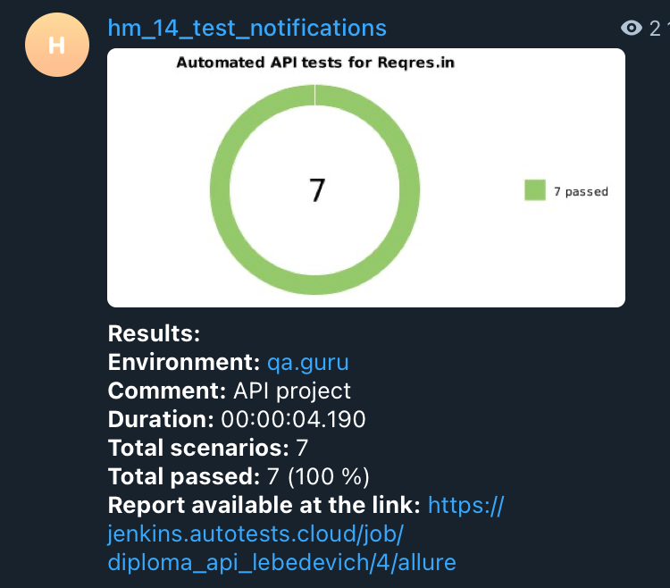

# Automated API tests for [Reqres.in](https://reqres.in)

## :pushpin: Content:

- [Stack of technologies](#computer-stack-of-technologies)
- [Running tests](#running_woman-running-tests)
- [Test cases](#page_facing_up-test-cases)
- [Build in Jenkins](#-build-in-jenkins)
- [Allure report](#-allure-report)
- [Allure TestOps Integration](#-allure-testops-integration)
- [Jira Integration](#-jira-integration)
- [Telegram notifications](#-telegram-notifications)


## :computer: Stack of technologies

<p align="center">
<a href="https://www.java.com/"></a>
<a href="https://www.jetbrains.com/idea/"></a>
<a href="https://github.com/"></a>
<a href="https://junit.org/junit5/"></a>
<a href="https://gradle.org/"></a>
<a href="https://docs.qameta.io/allure/"></a>
<a href="https://www.jenkins.io/"></a>
<a href="https://web.telegram.org/"></a>
<a href="https://www.atlassian.com/ru/software/jira"></a>
<a href="https://qameta.io/"></a>
<a href="https://rest-assured.io/"></a>
</p>


## :running_woman: Running tests

#### To run tests:

```
gradle clean test
```


### File *config.properties*
To run tests locally, you need to add the <code>config.properties</code> file to the resources folder <code>(src/test/resources/)</code>. The following properties must be specified in this file:
```
username=username
jobName=jobName
email=email
password=password
```


## :page_facing_up: Test cases

* Check user id
* Check for non-existent user
* Check user ids
* Check user creation
* Check successful registration
* Check failed registration without password
* Check user deletion


##  Build in [Jenkins](https://jenkins.autotests.cloud/job/diploma_api_lebedevich/)
<p align="center">


</p>


##  [Allure](https://jenkins.autotests.cloud/job/diploma_api_lebedevich/1/allure/) report
### Overview

<p align="center">

</p>

### Test result

<p align="center">

</p>


##  [Allure TestOps](https://allure.autotests.cloud/launch/27535) Integration

<p align="center">

</p>


##  [Jira](https://jira.autotests.cloud/browse/HOMEWORK-806) Integration

And also we can see from <code>Jira</code>, which tests been added to <code>Allure</code> with their statuses

<p align="center">

</p>


##  Telegram notifications

<p align="center">

</p>